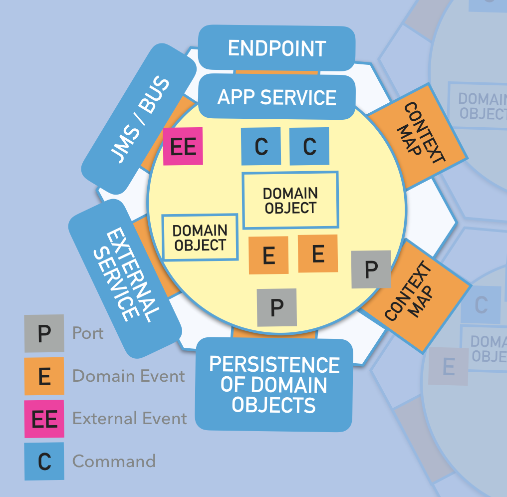

# hexagonal-architecture-demo
> 基于DDD和六边形架构的微服务DEMO

## Command Query CRUD Responsibility Segregation
Not every piece of software is equally important...
Not every piece will decide about company / product success or can cause not reversible
negative business consequences like materialise brand risk or money loses.
On the other hand scalability or non functional requirements are different for different activities in software.

To accommodate to those differences, separate architectural patterns are applied:

## Hexagonal Architecture
Only the most valuable part of that enterprise software is embedded in hexagonal architecture -
complex business processing modeled in form of the Domain Model.

**Application Services** - providing entry point to Domain Model functionality,
Application Services are ports for Primary / Driving Adapters like RESTfull endpoints.

**Domain Model** - Object Oriented (in that case) piece of software modeling business rules, invariants,
calculations and processing variants.
Thanks to hexagon can be as clean and simple as possible - separating essential complexity of pure business
from accidental complexity of technical choices, free of technical and convention constraints.

**Ports** - contract defined by Domain Model expressing expectations from external resources (services, database or other models).
Declared interfaces alongside with IN-OUT parameters are Ports for Secondary / Driven Adapters like repository implementation.

**Adapters** - integration of the technology (REST, database, external services, etc.) with the Domain Model.
Making useful application from the Domain Model and the technology.